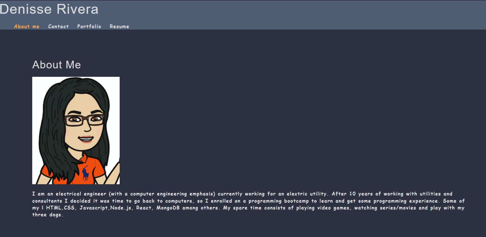

# React Portfolio

## Description

Week 20 was to create a Professional Portfolio by using React. This webpage will provide some information about myself, as well as a portfolio showcasing some of my projects

## Table of Contents

- [Screenshot](#screenshot)
- [Credits](#credits)
- [License](#license)
- [Questions](#questions)

## Screenshot

## Website

Click [here](https://riveradenisse.github.io/react-portfolio/) to visit my professional portfolio

## License

This application is covered by MIT License. For more information about the license please click [here](https://choosealicense.com/licenses/mit/)

## Questions

For any questions, please contact me using the information below:

- Github Profile: [RiveraDenisse](https://github.com/RiveraDenisse)
- Email me at : denisse_alejandrar@hotmail.com
